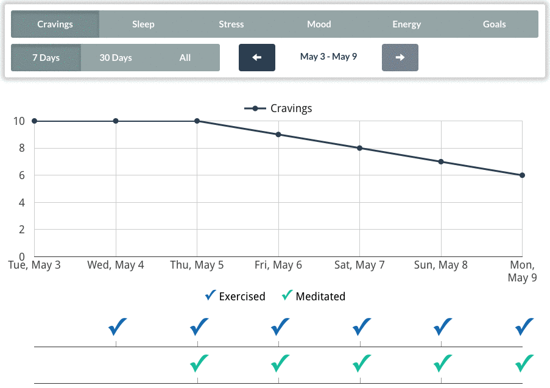
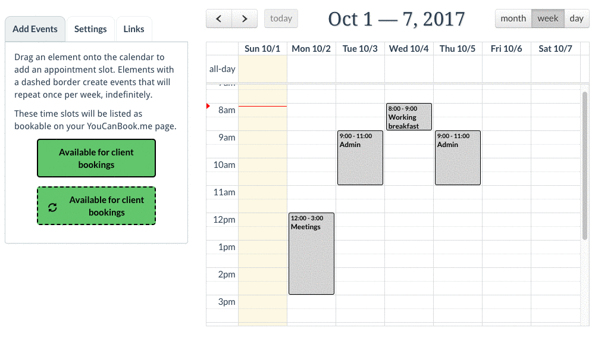
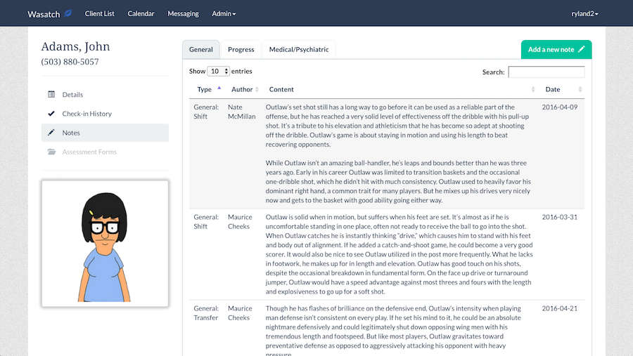

# Recovery Center Client-Tracking Software

## About

I worked with a small team to design an app to help substance abuse recovery facilities manage their work with clients. My role was to build a prototype for a front-end web interface that consumes a RESTful API managed by another team member. During the development process, I also contributed to discussions about which features to include, and the design of the data models used on the back-end.

**Note:** This app is no longer connected to a publically accessible development database (with bogus client data), so I can't link to a live version. I'm sharing this README and the source code to document my work for my portfolio.

### Check-in History

The core feature of this app is to provide an interface for clinicians to view and explore daily check-in data submitted by clients through a separate iOS app. Each day, clients report subjective values (on a 1-10 scale) for things like their craving and energy levels, while also logging the completion of activities like exercise and meditation. This combination of binary and numerical data provided a challenge when designing an appropriate visualization. I ended up creating an interactive visualization that displays numerical data as a line graph over time, and binary data as checkmarks along the same time axis. This gives clinicians the freedom to explore the data and look for interesting patterns to inform their work or share with clients.

### Scheduling Tool

Our team also wanted to integrate appointment scheduling into the app. We ultimately decided to build on top of two existing services: Google calendars, and [youcanbook.me](http://youcanbook.me). I built a tool to display calendar data within the app, and to allow clinicians to mark available times through a simple drag-and-drop interface. Any times marked with a green "Available for client bookings" event are automatically included on the booking pages genereated by youcanbook.me. 

This tool was designed to help users do a few key tasks conveniently from within our app, with the expectation that most calendar management still happens in existing calendar applications.

### Client Details & Notes

We also wanted this app to serve as a unified client-tracking system, so we also needed to collect and display client data (like contact info, a list of emergency and clinical contacts, and the client's history and status within the recovery center) and notes from clinicians and administrators. Because of the sensitivity of this data, we created a careful set of nested permission levels to control who can access which data.
